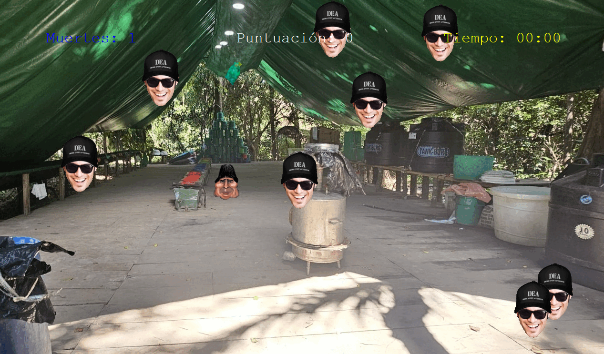
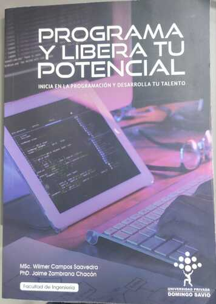

# Proyecto: El Escape De Evo
En un mundo alterno donde gano el candidato Tuto Quiroga la presidencia del pais permitio el ingreso de la DEA al Chapare a capturar al ex presidente Evo Morales Ayma, nos ubicamos desde la perspectiva del Ex presidente huyendo en un laboratorio de droga mientras recolecta bolsas de coca para no dejar morir su negocio


No permitas que te atrapen!!!!!


## Descripción del Proyecto

"El escape de Evo" es un juego de Python turtle emocionante, diseñado para llevar al limite lo que se puede hacer con la libreria turtle. Controla al Ex presidente y escapa de las hordas de agentes de la DEA. El destino del narco-estado está en tus manos!

## Configuración y Ejecución del Proyecto

Para configurar y ejecutar el juego, sigue los siguientes pasos:

- Clona este repositorio en tu sistema local.
- Asegúrate de tener Python 3.12 instalado.
- Instala las librerías necesarias utilizando:
 ``` bash pip install turtle ```  ``` bash pip install pygame ```  ``` bash pip install python-vlc ```  ``` bash pip install numpy ```
- Ejecuta el archivo game.py para iniciar el juego: python game.py
## Librerías Utilizadas

Este proyecto utiliza las siguientes librerías Python:
- [turtle](https://docs.python.org/3/library/turtle.html)
- [pygame](https://www.pygame.org/)
- [python-vlc](https://pypi.org/project/python-vlc/)

Python Turtle es una biblioteca gráfica integrada en Python que permite a los usuarios aprender programación de manera visual y divertida al controlar una "tortuga" virtual en una pantalla para dibujar y crear animaciones. Al enviar comandos simples como "avanzar" o "girar", los usuarios pueden hacer que la tortuga dibuje en el lienzo, lo que facilita la comprensión de conceptos básicos de programación como bucles y funciones. 

Pygame es una biblioteca de Python de código abierto diseñada para facilitar la creación de videojuegos y otras aplicaciones multimedia. Pygame ofrece módulos para gestionar gráficos, sonido, eventos de entrada (como pulsaciones de teclas y clics del mouse) y otras funcionalidades comúnmente requeridas en el desarrollo de videojuegos.

Python VLC es un conjunto de herramientas (enlaces) que permite a los desarrolladores de Python controlar el reproductor multimedia VLC y sus funcionalidades desde sus aplicaciones de Python. Este módulo actúa como un puente a la biblioteca libvlc, permitiendo a los desarrolladores crear sus propios reproductores de vídeo o audio personalizados, gestionar la reproducción, ajustar el volumen, cambiar la velocidad de reproducción y controlar otras funciones multimedia. 

## Libro: PROGRAMA Y LIBERA TU POTENCIAL
El libro titulado 'Programa y Libera tu Potencial' ha sido nuestra guía fundamental, proporcionándonos un sólido fundamento en la comprensión de los elementos esenciales de los algoritmos y la programación en Python. Su enfoque en la liberación del potencial creativo a través de la codificación ha sido un pilar esencial en la concepción y desarrollo de este proyecto.



Sobre los autores:
(http://programatupotencial.com)
## Agradecimientos

Queremos agradecer a nuestro docente, al decano de la facultad de ingeniería y a la Universidad Privada Domingo Savio - Sede (Santa Cruz) por su apoyo y orientación a lo largo de este proyecto.
## Cómo Contribuir
Como proyecto universitario, las contribuciones están limitadas a los miembros del equipo. Sin embargo, si encuentras algún error o tienes alguna sugerencia para mejorar el código o los análisis, no dudes en contactarte con el docente o el equipo de desarrollo.

Para cualquier pregunta o comentario, por favor contacta al correo electrónico (sc.jhonatan.mendoza.j@upds.net.bo) o a mi [Github](https://github.com/ForeBlack-coder) personal.

## Equipo de desarrollo
[UPDS](https://www.facebook.com/UPDS.bo)
- Decano de la Facultad: 
[Msc. Wilmer Campos Saavedra](https://www.facebook.com/wilmercampos1)
- Docente: 
[PhD.  JAIME ZAMBRANA CHACÓN](https://facebook.com/zambranachaconjaime)
- Equipo de desarrollo: 
[Jhonatan Mendoza Justiano (Estudiante UPDS)](https://www.facebook.com/jhonatan.mendozajustiniano?mibextid=2JQ9oc) 